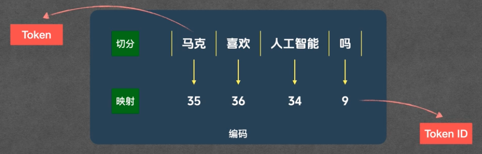
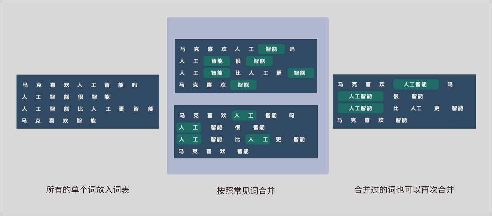
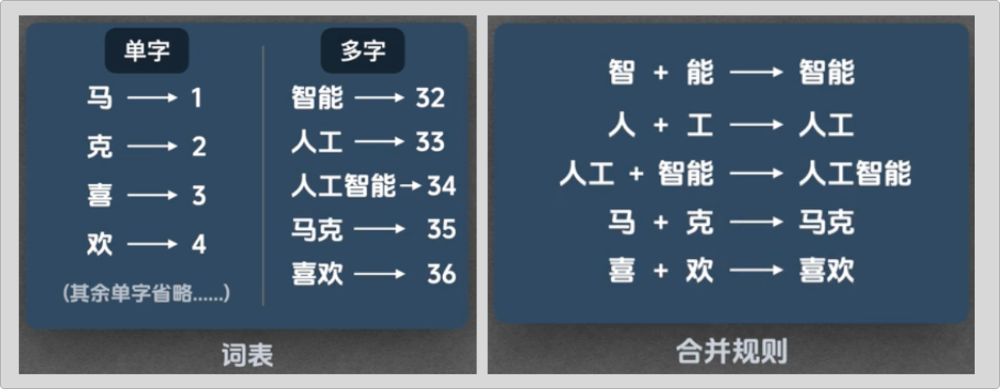
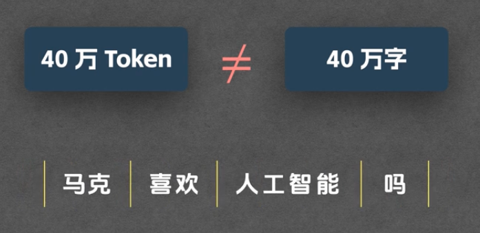

# Token

> 理解 AI

Token 到底是什么？— 揭秘大模型背后的「文字压缩术」。

在使用大模型时，你应该见过「Context Window」（上下文窗口）这个概念。比如某个模型说自己支持 40 万 Token 的上下文，意味着它一次最多能处理 40 万个 Token。

但这里说的不是 40 万个字，也不是 40 万个词，而是 40 万个 **Token**。

Token 是什么？为什么不直接用「字」来计算？搞懂这个问题，你就能理解大模型的工作原理、Context Window 的真实含义，以及 API 计费和 Prompt 设计背后的逻辑。

---

## 一、大模型的运行原理：数字进，数字出

大模型本质上是一个巨大的数学函数，内部全是矩阵运算。它的输入是数字，输出的也是数字。**它并不「理解」人类的文字。**

所以在人类语言和大模型之间，必须有一个「翻译官」— 它的名字叫 **Tokenizer**。

Tokenizer 干两件事：

- **编码**：把文字转换成数字，交给模型计算
- **解码**：把模型输出的数字转回文字，返回给用户

整个流程可以概括为：

```
用户输入文字
    ↓
Tokenizer 编码（文字 → 数字）
    ↓
模型内部运算（数字 → 数字）
    ↓
Tokenizer 解码（数字 → 文字）
    ↓
用户看到回答
```

接下来我们拆开每个环节，看看具体发生了什么。

---

## 二、编码与解码：一句话的完整旅程

假设用户提问：「马克喜欢人工智能吗？」

### 1. 编码：文字 → 数字

编码分两步：**切分** 和 **映射**。

**第一步：切分**

Tokenizer 把这句话切成最小的处理单位，这些切出来的「碎片」就是 **Token**。

比如「马克喜欢人工智能吗」可能被切分为：

```
马克 | 喜欢 | 人工智能 | 吗
```

注意：这不是按字切的，也不完全是按词切的。具体怎么切，取决于 Tokenizer 的训练结果（第三节会详细讲）。

**第二步：映射**

模型只认数字，所以 Tokenizer 要把每个 Token 映射为一个数字，这个数字叫 **Token ID**。

```
马克 → 35
喜欢 → 36
人工智能 → 34
吗 → 9
```

Token 和 Token ID 是一一对应的关系。Token 是文字形式，Token ID 是数字形式，就像一枚硬币的正反面 — 内容相同，只是表达方式不同。



经过切分和映射，原本的一句话变成了一串数字 `[35, 36, 34, 9]`。Tokenizer 把这个列表交给模型，模型在内部完成运算，输出一个（或一串）Token ID。

### 2. 解码：数字 → 文字

模型运算完毕，输出一个 Token ID（比如 36）。这时 Tokenizer 再次登场，做反向的映射：

```
36 → 喜欢
```

解码只有一步 — **映射**，方向和编码相反：把数字映射回文字。

为什么解码不需要「切分」？因为模型每次给出的就是一个 Token ID，没有「再切一刀」的必要。

如果模型还没说完，会继续输出第二个、第三个 Token ID，Tokenizer 依次解码，直到生成结束。这也是你在聊天时看到 AI「一个词一个词往外蹦」的原因 — 它确实是一个 Token 一个 Token 地生成的。

---

## 三、Tokenizer 是怎么来的

上面提到编码需要「切分」和「映射」，但具体按什么规则切？映射表从哪里来？

答案是：**Tokenizer 是训练出来的。**

不过别被「训练」吓到 — Tokenizer 的训练和大模型的训练不一样，不涉及复杂的神经网络和梯度下降，更像是一个「统计 + 合并」的过程。

业界有多种实现方式：

- **BPE**（Byte Pair Encoding）：OpenAI、Anthropic 等公司采用
- **Unigram**：Google 多用这种方式

下面以 BPE 为例，看看 Tokenizer 是怎么被训练出来的。

### 1. BPE 的核心思想：找「经常一起出现的字」

从大量文本中统计哪些字经常相邻出现，然后把它们合并成一个 Token。

目标很朴素：让「词」或「常见字组合」整体成为一个 Token，而不是永远拆成单字。这样同一句话用更少的 Token 就能表达，模型处理起来更高效。



### 2. 训练的两个产物

准备好一批训练用的文本材料后，BPE 训练会产出两样东西：

| 产物 | 作用 |
|------|------|
| **词表（Vocabulary）** | 记录每个 Token 和 Token ID 的对应关系，是编码和解码时的「查找表」 |
| **合并规则（Merge Rules）** | 记录「哪两个片段应该合并成一个 Token」，是切分时的「操作手册」 |



### 3. 从单字开始

训练的第一步：把训练材料里所有出现过的单字放进词表。

比如「马」「克」「喜」「欢」「人」「工」「智」「能」「吗」等，每个字就是一个 Token，各自分配一个 Token ID。

> Token ID 只是编号，不携带语义信息。不要和 Embedding 混淆 — Embedding 里语义相近的词会有相近的向量，但 Token ID 之间没有这种关系。

此时词表里只有单字，已经可以当最简单的 Tokenizer 用了。但问题是：「马克喜欢人工智能吗？」会被切成 9 个 Token（每个字一个），序列太长，效率很低。

所以我们需要把常见的字组合也加入词表。这就是合并规则要做的事。

### 4. 合并规则是怎么来的：逐轮统计 + 合并

做法是让算法扫描训练材料，统计哪些字（或片段）经常相邻出现，然后按频率从高到低逐步合并。

下面用简化的例子演示这个过程：

**第一轮：合并「智」和「能」**

算法扫描后发现：「智」和「能」相邻出现的频率最高（比如出现了 5 次）。于是执行第一次合并：

- 在词表中新增 Token「智能」，分配一个 Token ID
- 在合并规则中记录：`智 + 能 → 智能`

从此以后，Tokenizer 只要看到「智」和「能」挨在一起，就会把它们合并为一个 Token。

**第二轮：合并「人」和「工」**

继续扫描，「人」和「工」相邻出现了 4 次，频率最高。合并为「人工」，加入词表，记录规则。

**第三轮：合并「人工」和「智能」**

注意：这一轮合并的不再是单字，而是前两轮已经合并出的片段。「人工」和「智能」经常连在一起（出现了 3 次），于是合并为「人工智能」。

这说明：**合并产生的片段可以继续参与后续合并**，Tokenizer 因此能识别越来越长的词。

**后续轮次**

按同样逻辑，继续合并「马克」「喜欢」等。全部处理完后，我们就得到了一个训练好的 Tokenizer，核心就是那两样东西：**词表 + 合并规则**。

### 5. 训练过程总结

```
大量文本材料
    ↓
初始化词表（所有单字）
    ↓
反复执行：统计最高频的相邻片段 → 合并 → 加入词表和规则
    ↓
达到预设词表大小后停止
    ↓
产出：词表 + 合并规则
```

---

## 四、推理时 Tokenizer 怎么用

训练好的 Tokenizer 在实际使用（推理）时是怎么工作的？回到那句「马克喜欢人工智能吗？」。

### 编码：切分 → 映射

**切分阶段**：

1. 先把句子拆成单字：`马 | 克 | 喜 | 欢 | 人 | 工 | 智 | 能 | 吗`
2. 按合并规则的顺序，逐条检查并合并：
   - `智 + 能 → 智能`
   - `人 + 工 → 人工`
   - `人工 + 智能 → 人工智能`
   - `喜 + 欢 → 喜欢`
   - `马 + 克 → 马克`
3. 合并完毕，得到 4 个 Token：`马克 | 喜欢 | 人工智能 | 吗`

**映射阶段**：

查词表，把每个 Token 转成 Token ID：

```
马克 → 35，喜欢 → 36，人工智能 → 34，吗 → 9
```

编码完成，把 `[35, 36, 34, 9]` 交给模型。

### 解码：只做映射

模型输出一个 Token ID（比如 36），查词表：`36 → 喜欢`，返回给用户。

后续的 Token 同理：输出一个 ID，查表一次，直到生成结束。

---

## 五、回到开头：为什么 40 万 Token ≠ 40 万字？

现在可以回答开头的问题了。

Tokenizer 不只是一个「翻译机」，还是一个 **压缩机**：它把经常一起出现的字合并成一个 Token。就像例子中的「马克喜欢人工智能吗」— 9 个字被压缩成了 4 个 Token。



不同语言的压缩率不同。大致的换算关系：

| 语言 | 换算比例 |
|------|---------|
| 中文 | 1 个 Token ≈ 1.5 ~ 2 个汉字 |
| 英文 | 1 个 Token ≈ 4 个英文字母（约 0.75 个单词） |

所以，40 万 Token 的 Context Window 大致相当于：

- **60 万 ~ 80 万汉字**
- **约 30 万英文单词**

### 理解 Token 有什么实际用处？

| 场景 | 为什么需要理解 Token |
|------|------------------|
| **写 Prompt** | Context Window 有上限，塞太多内容会被截断。理解 Token 帮你判断「还能放多少信息进去」 |
| **API 计费** | 大模型 API 按 Token 数量计费（输入 + 输出），知道换算关系才能估算成本 |
| **理解限速** | API 的速率限制通常按「每分钟 Token 数」计算，不是按请求次数 |
| **多语言差异** | 同样一段内容，中文和英文消耗的 Token 数不同，影响可用的上下文空间 |

---

## 六、小结

| 概念 | 一句话解释 |
|------|----------|
| **Token** | 大模型处理文本的最小单位，可能是一个字、一个词，也可能是一个词的一部分 |
| **Token ID** | Token 对应的数字编号，是模型实际处理的输入 |
| **Tokenizer** | 负责文字与数字之间互相转换的「翻译官」 |
| **词表** | Token 与 Token ID 的映射表 |
| **合并规则** | 决定哪些字/片段应该合并为一个 Token |
| **BPE** | 一种主流的 Tokenizer 训练算法，核心逻辑是「统计高频相邻片段 → 合并」 |
| **Context Window** | 模型一次能处理的最大 Token 数，不等于字数 |

理解 Token 和 Tokenizer，是理解大模型如何「读进去、写出来」文字的第一步，也是理解 Context Window 限制、API 计费、限速等设定背后逻辑的基础。

> 下一篇我们会聊「幻觉」— AI 为什么有时候会一本正经地胡说八道。
